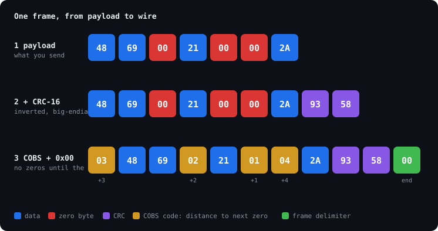

# cobs-link

[](https://github.com/CannonThomas/cobs-link/actions/workflows/ci.yml)

A small C99 library that turns a raw byte stream (UART, RS-485, USB CDC, a radio)
into reliable packets: **COBS framing + CRC-16**, no `malloc`, no globals, one
`.c` file and one header.

**[▶ Try the interactive frame visualizer](https://cannonthomas.github.io/cobs-link/)** —
type a payload, click bits on the wire to corrupt them, and watch the receiver react.



## Why

A UART gives you bytes, not messages. The receiver has to answer two questions
on its own: *where does a packet start and end?* and *did it arrive intact?*

- **COBS** (Consistent Overhead Byte Stuffing) rewrites the packet so it contains
  no `0x00` bytes, which frees `0x00` to mean "end of frame". A receiver that
  powers up mid-stream, or loses bytes to noise, is back in sync at the next
  zero. The cost is 1 byte per 254, worst case.
- **CRC-16** over the payload catches corruption.

## Usage

```c
#include "cobs_link.h"

/* transmit */
uint8_t frame[CL_FRAME_MAX_ENCODED(sizeof msg)];
size_t n = cl_frame_encode((const uint8_t *)&msg, sizeof msg, frame, sizeof frame);
uart_write(frame, n);

/* receive: call once per byte, e.g. from the UART RX interrupt */
static uint8_t rx_buf[CL_FRAME_MAX_ENCODED(MAX_MSG)];
static cl_rx_t rx;                      /* cl_rx_init(&rx, rx_buf, sizeof rx_buf); */

void on_uart_byte(uint8_t b)
{
    const uint8_t *payload;
    size_t len;
    if (cl_rx_push(&rx, b, &payload, &len) == CL_RX_FRAME) {
        handle_message(payload, len);
    }
}
```

`cl_rx_t` also keeps running counters (`frames_ok`, `crc_errors`,
`framing_errors`, `overflows`) so link quality can be reported as telemetry.

Design choices:

- **Zero allocation.** The caller owns every buffer; sizes come from macros that
  are usable in array declarations.
- **Constant work per received byte** until the delimiter, then one in-place
  decode. Frames are decoded inside the receive buffer, so RAM use is one buffer.
- **Zero-copy encode.** The payload and CRC are streamed through the COBS
  encoder directly into the output buffer.
- **Oversized frames are dropped, not written past the buffer**, and the
  receiver recovers on the next frame.

## A bug the tests found

The first version sent a plain big-endian CRC-16/CCITT. A randomized test that
flips one bit per frame turned up a frame that was *accepted with the wrong
payload*, and it was not bad luck:

- If the CRC's low byte is `0x00` (1 frame in 256), the frame ends in the COBS
  code byte `0x01`.
- Flip that byte's one set bit and it becomes `0x00`: an early delimiter. The
  receiver sees a frame that is one byte shorter, and reads the last payload
  byte and the CRC's high byte as the CRC.
- That always checks out. Feeding a CRC register its own high byte clears the
  low byte, so a CRC ending in `0x00` means exactly that the previous CRC was
  `(last payload byte, CRC high byte)`.

So a single bit error could silently chop the last byte off a packet. Checking
all 65,536 CRC states × 256 final bytes confirmed it: the truncated frame was
accepted **every time** the pattern occurred. Sending the CRC inverted
(CRC-16/GENIBUS) breaks the identity; the same exhaustive check then accepts
**zero** truncated frames, and `test_truncation_by_bit_flip_rejected` keeps it
that way.

More generally, COBS can turn one flipped bit into a multi-byte error (a
damaged code byte moves a zero or splits the frame), so the CRC's "all
single-bit errors detected" guarantee does not carry over to the framed link.
What remains is the ordinary 2⁻¹⁶ miss rate for the flips that restructure a
frame. If that is not enough for your link, use a longer CRC or add a length
field.

## Testing

```
make test      # unit tests under ASan + UBSan
make cross     # C library vs. an independent Python implementation
make js        # the demo's JavaScript port vs. the Python implementation
make example   # 100,000 packets through a simulated noisy UART
```

- Known COBS vectors, plus every edge around the 254-byte block boundary.
- CRC check values (`0x29B1` raw, `0xD64E` as sent).
- 20,000 random payloads round-tripped byte-by-byte through the receiver.
- 200,000 single-bit-flip injections.
- Resync after garbage, idle-line delimiters, buffer-overflow containment
  (checked with guard bytes).
- 3,000 payloads framed by both the C and Python implementations must match
  byte for byte, and each side must decode the other's output.

CI runs all of it on GCC and Clang.

The noisy-channel example flips or drops roughly 1 byte in 200:

```
sent              100000
delivered intact  93620 (93.62%)
rejected: crc     2408
rejected: framing 3074
rejected: overflow477
corrupt delivered 0
```

## Layout

```
include/cobs_link.h     public API
src/cobs_link.c         implementation
tests/                  unit tests, C↔Python and JS↔Python cross-checks
tools/cobs_link.py      Python implementation (usable on the PC side of a link)
tools/frame_svg.py      generates the diagram above from the real encoder
examples/               noisy-channel simulation
docs/                   interactive visualizer (GitHub Pages)
```

## License

MIT
